# Evidence Pack - GitOps-ify-Rabbitboy

> Hướng dẫn: điền thêm những phần còn thiếu bằng dữ liệu thực tế, ảnh chụp màn hình, output lệnh, và ghi chú theo từng lab.

## 1. Thông tin môi trường

- **Ngày thực hiện:** 11/06/2026
- **Máy / thiết bị:** Windows 10, Docker Desktop, Minikube
- **Hệ điều hành:** Windows
- **RAM:** 8GB
- **Docker Desktop:** 4.76.0
- **Minikube profile:** `w9`
- **Namespace / cụm chính:** `argocd`, `demo`, `monitoring`, `argo-rollouts`
- **Công cụ đã dùng:** `kubectl`, `minikube`, `docker`, `git`, `ArgoCD`

## 2. Mục tiêu của bài lab

- Dựng local GitOps stack bằng Minikube.
- Dùng ArgoCD theo mô hình app-of-apps.
- Deploy frontend, backend, API, rollout, monitoring, alerting.
- Kiểm tra self-heal, prune, sync, metrics, và cảnh báo email.

## 3. Những phần đã hoàn thành

- [ ] Chuẩn bị môi trường local
- [ ] Khởi tạo Minikube cluster
- [ ] Cài ArgoCD
- [ ] Bootstrap `root Application`
- [ ] Deploy `backend`
- [ ] Deploy `frontend`
- [ ] Deploy `api`
- [ ] Deploy `argo-rollouts`
- [ ] Deploy `kube-prometheus-stack`
- [ ] Deploy `monitoring-lab`
- [ ] Cấu hình `ServiceMonitor`
- [ ] Cấu hình email Alertmanager
- [ ] Test frontend/backend
- [ ] Test API `/healthz` và `/metrics`
- [ ] Test Prometheus query
- [ ] Test alert email
- [ ] Kiểm tra self-heal / prune / sync

## 4. Danh sách phần đã tắt vì RAM 8GB

> Ghi rõ các component đã cố ý tắt để cluster nhẹ hơn. Nếu có thay đổi thì sửa lại cho đúng.

- [ ] Grafana — lý do: vì tốn RAM, không thể chạy được trên máy 8GB.
- [ ] kube-state-metrics — lý do: tắt để giảm tải RAM/CPU cho cụm local; phần lab hiện tại không cần số liệu chi tiết từ Kubernetes objects.
- [ ] node-exporter — lý do: tắt vì không bắt buộc cho bài lab này và giúp cluster nhẹ hơn trên máy chỉ có 8GB RAM.
- [ ] default Prometheus rules — lý do: tắt để tránh tăng số lượng rule và alert không cần thiết, giữ monitoring tối giản cho môi trường local.
- [ ] Thành phần khác — lý do: các component phụ trợ chưa cần cho mục tiêu lab hiện tại nên được tạm tắt để ưu tiên độ ổn định.

## 5. Bằng chứng theo từng phần

### 5.1. Minikube / cluster

- **Lệnh đã chạy:**
  - `minikube start -p w9 --driver=docker`
  - `kubectl config use-context w9`
  - `kubectl get nodes`
- **Kết quả mong đợi:** cluster `Ready`
- **Ảnh / file đính kèm:** 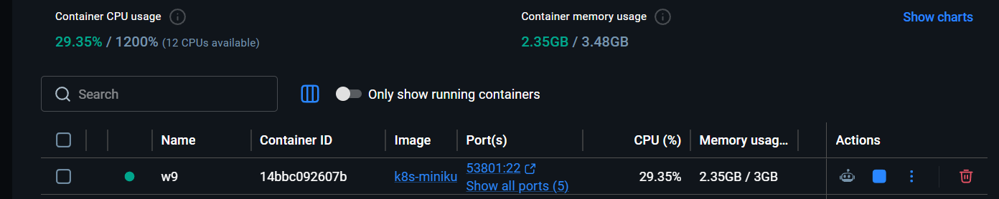

### 5.2. ArgoCD

- **Lệnh đã chạy:**
  - `kubectl -n argocd get pods`
  - `kubectl -n argocd get applications`
  - `kubectl -n argocd port-forward svc/argocd-server 8080:443`
- **Kết quả mong đợi:** `argocd-server` chạy ổn, applications `Synced/Healthy`
- **Ảnh / file đính kèm:** 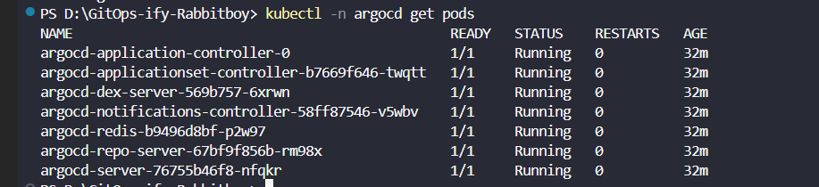

### 5.3. Root application / app-of-apps

- **File liên quan:** `argocd/root.yaml`
- **Application con:** `backend`, `frontend`, `api`, `argo-rollouts`, `kube-prometheus-stack`, `monitoring-lab`

### 5.4. Frontend / backend

- **Lệnh đã chạy:**
  - `kubectl -n demo get deployments,pods,services`
  - `kubectl -n demo port-forward svc/frontend 8081:80`
  - `kubectl -n demo port-forward svc/backend 5678:5678`
- **Kết quả mong đợi:** frontend hiển thị nội dung, backend trả JSON/echo
- **Ảnh / file đính kèm:** 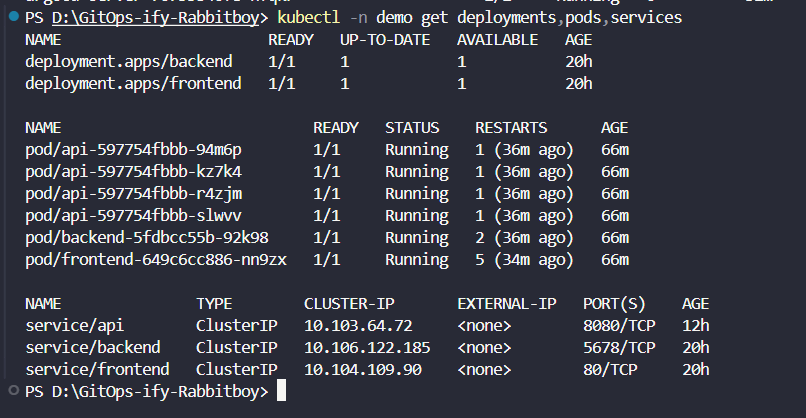
  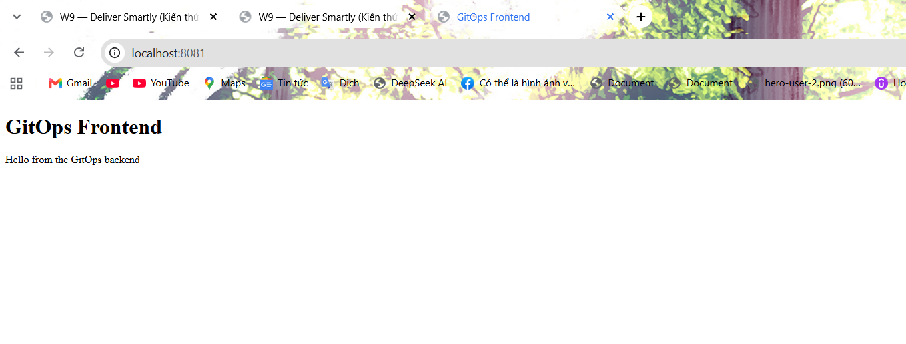
  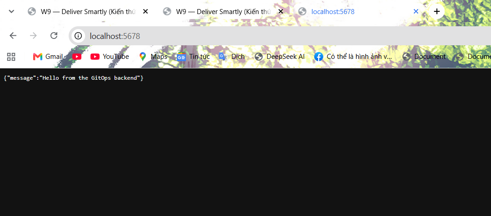

### 5.5. API / Argo Rollouts

- **File liên quan:** `k8s-api/api.yaml`, `k8s-api/servicemonitor.yaml`
- **Lệnh đã chạy:**
  - `kubectl -n demo port-forward svc/api 18080:8080`
  - `kubectl -n argo-rollouts get pods`
- **Kết quả mong đợi:** API trả `/`, `/healthz`, `/metrics`
- **Ảnh / file đính kèm:** 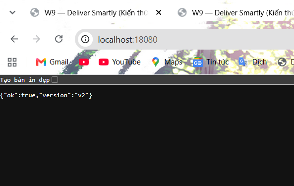
  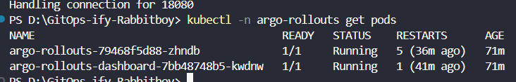

### 5.6. Prometheus / monitoring

- **Lệnh đã chạy:**
  - `kubectl -n monitoring get pods`
  - `kubectl -n monitoring port-forward svc/kube-prometheus-stack-prometheus 9090:9090`
  - Query ví dụ: `up{namespace="demo", service="api"}`
- **Kết quả mong đợi:** target scrape lên, query trả dữ liệu
- **Ảnh / file đính kèm:** 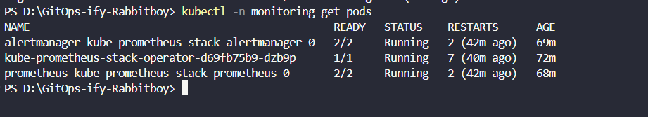
  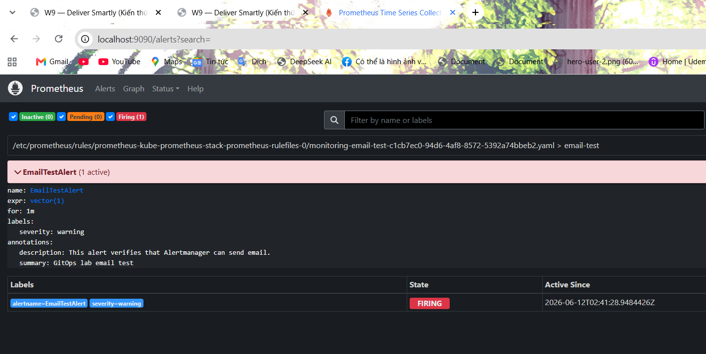
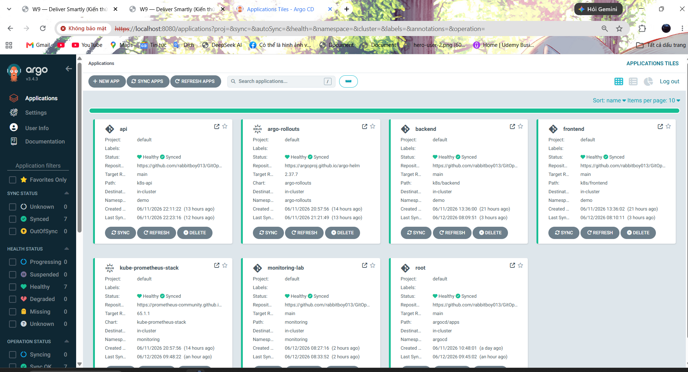

### 5.7. Alertmanager / email test

- **File liên quan:** `scripts/configure-alertmanager-email.ps1`, `monitoring/email-test-rule.yaml`
- **Lệnh đã chạy:**
  - `.\scripts\configure-alertmanager-email.ps1`
  - `kubectl -n monitoring port-forward svc/kube-prometheus-stack-alertmanager 9093:9093`
- **Kết quả mong đợi:** email test alert được gửi
- **Ảnh / file đính kèm:** 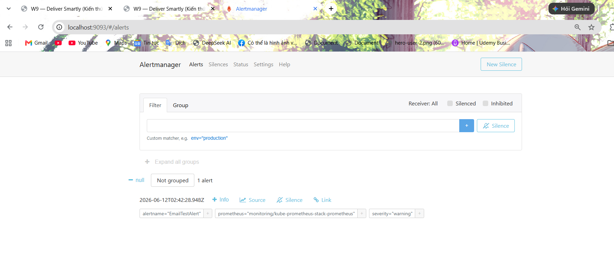

## 6. Các file đã chỉnh sửa

> Liệt kê những file bạn đã thay đổi để phục vụ lab, kể cả file tắt bớt component.

- `argocd/apps/kube-prometheus-stack.yaml` — cấu hình các thành phần monitoring được bật/tắt.
- `argocd/apps/monitoring-lab.yaml` — cấu hình namespace / rule test.
- `k8s-api/api.yaml` — cấu hình API rollout/service/env.
- `k8s-api/servicemonitor.yaml` — cấu hình scrape metrics.
- `monitoring/email-test-rule.yaml` — rule test alert email.
- `scripts/configure-alertmanager-email.ps1` — cấu hình Alertmanager email.
- `README.md` — nếu có cập nhật hướng dẫn.

## 7. Những gì chưa làm / chưa bật

- [ ] Chưa bật Grafana do giới hạn RAM
- [ ] Chưa bật component monitoring nặng khác
- [ ] Chưa chụp đủ ảnh minh chứng
- [ ] Chưa xác nhận phần nào khác:

## 8. Vấn đề đã gặp và cách xử lý

- **Vấn đề 1:** do bị giới hạn ram nên phải set thấp các yêu cầu trong lab cho là CPU và RAM 6gb
  - **Nguyên nhân:** không thể chạy được , bị giới hạn ram khiến các local khác bị tràn và lỗi log
  - **Cách xử lý:** Điều chỉnh và tắt bớt những phần không cần thiết
- **Vấn đề 2:**
  - **Nguyên nhân:**
  - **Cách xử lý:**

## 9. Kết luận cuối

- **Trạng thái tổng quan:** Chạy được prometheus, API, frontend/backend, ArgoCD app-of-apps, alert email test.
- **Các phần chạy ổn:** `argocd-server`, `kube-prometheus-stack`, `monitoring-lab`

## 10. Lý do các phần code đã hoàn thành

> Dùng mục này để ghi ngắn gọn “vì sao làm phần đó”, tức là lý do tồn tại của từng khối code/lab.

- **Minikube cluster:** để có môi trường Kubernetes local ổn định cho toàn bộ lab.
- **ArgoCD root application:** để quản lý các application con theo mô hình app-of-apps, đúng tinh thần GitOps.
- **Backend riêng:** để tách phần xử lý dữ liệu/API khỏi giao diện, giúp dễ test và dễ scale.
- **Frontend riêng:** để mô phỏng luồng người dùng truy cập UI và gọi backend.
- **Flask API + `/metrics`:** để có service có thể quan sát bằng Prometheus, phục vụ phần monitoring.
- **Argo Rollouts:** để minh họa progressive delivery/canary và kiểm tra rollout tự động.
- **ServiceMonitor:** để Prometheus tự scrape metrics mà không cần cấu hình thủ công quá nhiều.
- **Prometheus stack:** để theo dõi trạng thái cluster, target, và metric của API.
- **Alertmanager email test:** để xác minh pipeline cảnh báo hoạt động end-to-end.
- **Tắt một số component nặng:** để giữ cho cluster chạy được trên máy chỉ có 8GB RAM và tránh pod bị nghẽn.
